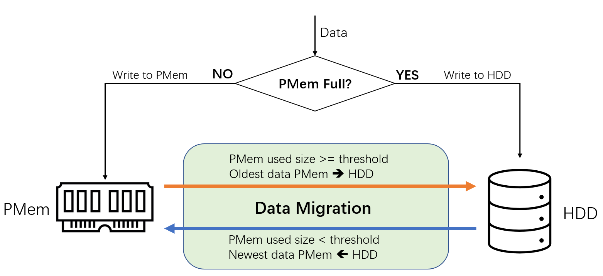

[](https://join.slack.com/t/memarkworkspace/shared_invite/zt-o1wa5wqt-euKxFgyrUUrQCqJ4rE0oPw)
[](https://github.com/4paradigm/pafka/releases)
[](https://hub.docker.com/r/4pdopensource/pafka-dev)
[](https://github.com/4paradigm/pafka/stargazers)
[](https://github.com/4paradigm/pafka/network/members)
[](https://github.com/4paradigm/pafka/blob/main/LICENSE)


Pafka: Persistent Memory (PMem) Accelerated Kafka
===

## 1. Introduction

Pafka is an evolved version of Apache Kafka developed by [MemArk](https://memark.io/en). Kafka is an open-source distributed event streaming/message queue system for handling real-time data feeds efficiently and reliably. However, its performance (e.g., throughput and latency) is constrained by slow external storage. Pafka enhances Kafka based on tiered storage architecture, which is usually equipped with high-performance SSD or Intel® Optane™ Persistent Memory (PMem). With the careful design of data migration algorithms, it improves overall persistence performance with low cost. For example, it can well support the scenario that high data production rate is repeated after an interval of time (e.g., special discount is released every one hour from a shopping website); it is also capable of improving the overall performance when high throughput is required over a long period. 

Please refer to our latest blog for Pafka benchmark and use cases :point_right: xxxxxxxxxxxxxx (中文版本)

## 2. Architecture

The basic idea behind Pafka is to utilize tiered storage architecture to enhance overall performance of a system. Nowadays, a data center may have various kinds of storage devices, such as HDD, SSD, and state-of-the-art non-volatile [persistent memory](https://www.intel.sg/content/www/xa/en/architecture-and-technology/optane-dc-persistent-memory.html). However, Kafka is not aware of such storage hierarchy. In this project, we enhance Kafka by using the high performance storage device, e.g., PMem, as the first layer of storage, together with carefully designed migration algorithms, to significantly improve overall performance for specific scenarios.

The key challenge of taking advantage of tiered storage is to design the data partitioning and migration mechanism between the fast and slow devices. The overall architecture and key workflow of Pafka are illustrated in the below figure. Basically, data is written onto PMem when there is available space, otherwise onto HDD. Besides, there is a background migration task to balance the data between PMem and HDD. Specifically, a new parameter `storage.migrate.threshold` is introduced to indicate when the migration is triggered. Specifically, when the used space of PMem exceeds the threshold, the oldest data on the PMem is migrated to HDD; otherwise the newest data on the HDD is migrated to PMem. The migration tries to keep the fresh data in the PMem to achieve the efficiency of consumers.



## 3. Get Started

For the complete documentation of Kafka, refer to [here](README.kafka.md).

### 3.1. Docker Image
The easiest way to try Pafka is to use the docker image: https://hub.docker.com/r/4pdopensource/pafka-dev

```
docker run -it -v $YOUR_PMEM_PATH:/mnt/mem 4pdopensource/pafka-dev bash
```

where $YOUR_PMEM_PATH is the mount point of PMem (DAX file system) in the host system.

If you use the docker image, you can skip the following `Compile` step.

### 3.2. Compile

#### 3.2.1. Dependencies

- [pmdk pcj](https://github.com/4paradigm/pcj)
- [pmdk llpl](https://github.com/4paradigm/llpl)

> :warning: **We have done some modifications on the original pmdk source codes. 
> Please download the source code from the two repositories provided above.**

We have already shipped pcj and llpl jars in `libs` folder in the Pafka repository. They are compiled with java 8 and g++ 4.8.5. In general, you are not required to compile the two libraries by yourself. However, if you encounter any compilation/running error caused by these two libraries, you can download the source codes and compile on your own environment as below.

After cloning the source code:

```bash
# compile pcj
cd pcj
make && make jar
cp target/pcj.jar $PAFKA_HOME/libs

# compile llpl
cd llpl
make && make jar
cp target/llpl.jar $PAFKA_HOME/libs
```

#### 3.2.2. Build Pafka Jar

    ./gradlew jar

### 3.3. Run

#### 3.3.1. Environmental Setup
To verify the correctness, you can use any file systems with normal hard disks. To take advantage of tiered storage architecture, it requires the availability of PMem hardware mounted as a DAX file system. 


#### 3.3.2. Config

In order to support PMem storage, we add some more config fields to the Kafka [server config](config/server.properties). 

|Config|Default Value|Note|
|------|-------------|----|
|storage.pmem.path|/pmem|pmem mount path. first-layer storage <br /> (Only applicable if log.channel.type=mix or pmem)|
|storage.pmem.size|-1|pmem capacity in bytes; -1 means use all the space <br />(Only applicable if log.channel.type=mix or pmem)|
|storage.hdd.path|/hdd|hdd mount path. second-layer storage <br />(Only applicable if log.channel.type=mix)|
|storage.migrate.threads|1|the number of threads used for migration <br />(Only applicable if log.channel.type=mix)|
|storage.migrate.threshold|0.5|the threshold used to control when to start the migration. <br /> -1 means no migration. <br />(Only applicable if log.channel.type=mix)|
|log.channel.type|file|log file channel type. <br /> Options: "file", "pmem", "mix".<br />"file": use normal FileChannel as vanilla Kafka does <br />"pmem": use PMemChannel, which will use pmem as the log storage<br />"mix": use MixChannel, which will use pmem as the first-layer storage and hdd as the second-layer storage|
|log.pmem.pool.ratio|0.8|A pool of log segments will be pre-allocated. This is the proportion of total pmem size. Pre-allocation will increase the first startup time, but can eliminate the dynamic allocation cost when serving requests.<br />(Only applicable if log.channel.type=mix or pmem)|

> :warning: **`log.preallocate` has to be set to `true` if pmem is used, as PMem MemoryBlock does not support `append`-like operations.**

Sample config in config/server.properties is as follows:

    log.dirs=/pmem/kafka-pool
    storage.pmem.path=/pmem/kafka
    storage.pmem.size=600000000000
    storage.hdd.path=/hdd/kafka-pool
    log.pmem.pool.ratio=0.8
    log.channel.type=mix
    # log.preallocate have to set to true if pmem is used
    log.preallocate=true

#### 3.3.3. Start Pafka
Follow instructions in https://kafka.apache.org/quickstart. Basically:

    bin/zookeeper-server-start.sh config/zookeeper.properties > zk.log 2>&1 &
    bin/kafka-server-start.sh config/server.properties > pafka.log 2>&1 &

 #### Benchmark Pafka

 ##### Producer

###### Single Client
```bash
# bin/kafka-producer-perf-test.sh --topic $TOPIC --throughput $MAX_THROUGHPUT --num-records $NUM_RECORDS --record-size $RECORD_SIZE --producer.config config/producer.properties --producer-props bootstrap.servers=$BROKER_IP:$PORT
bin/kafka-producer-perf-test.sh --topic test --throughput 1000000 --num-records 1000000 --record-size 1024 --producer.config config/producer.properties --producer-props bootstrap.servers=localhost:9092
```

###### Multiple Clients
We provide a script to let you run multiple clients on multiple hosts.
For example, if you want to run 16 producers in each of the hosts, `node-1` and `node-2`, you can run the following command:
```bash
bin/bench.py --threads 16 --hosts "node-1 node-2" --num_records 100000000 --type producer
```
In total, there are 32 clients, which will generate 100000000 records. Each client is responsible for populating one topic.

> In order to make it work, you have to configure password-less login from the running machine
> to the client machines.


You can run `python3 bin/bench.py --help` to see other benchmark options.

 ##### Consumer

###### Single Client
```bash
# bin/kafka-consumer-perf-test.sh --topic $TOPIC --consumer.config config/consumer.properties --bootstrap-server $BROKER_IP:$PORT --messages $NUM_RECORDS --show-detailed-stats --reporting-interval $REPORT_INTERVAL --timeout $TIMEOUT_IN_MS
bin/kafka-consumer-perf-test.sh --topic test --consumer.config config/consumer.properties --bootstrap-server localhost:9092 --messages 1000000 --show-detailed-stats --reporting-interval 1000 --timeout 100000
```

###### Multiple Clients
Similarly, you can use the same script as producer benchmark to launch multiple clients.
```bash
bin/bench.py --threads 16 --hosts "node-1 node-2" --num_records 100000000 --type consumer
```

## 4. Limitations

- pmdk llpl `MemoryPool` does not provide a `ByteBuffer` API.
We did some hacking to provide a zero-copy ByteBuffer API. You may see some warnings from JRE with version >= 9.
We've tested on Java 8, Java 11 and Java 15.

   > WARNING: An illegal reflective access operation has occurred
   > WARNING: Illegal reflective access by com.intel.pmem.llpl.MemoryPoolImpl to field java.nio.Buffer.address
   > WARNING: Please consider reporting this to the maintainers of com.intel.pmem.llpl.MemoryPoolImpl
   > WARNING: Use --illegal-access=warn to enable warnings of further illegal reflective access operations
   > WARNING: All illegal access operations will be denied in a future release


- Currently, only the log files are stored in PMem, while the indexes are still kept as normal files, as we do not see much performance gain if we move the indexes to PMem.
- Release `v0.1.x` uses PMem as the only storage device, which may limit the use for some scenarios that require a large capacity for log storage. Release `v0.2.0` addresses this issue by introducing a tiered storage strategy.


## 5. Roadmap

| Version |	Status | Features |
|---|---|---|
|v0.1.1|Released|- Use PMem for data storage <br /> - Significant performance boost compared with Kafka |
|v0.2.0|Released|- A two-layered storage strategy to utilize the total capacity of all storage devices while maintaining the efficiency by our cold-hot data migration algorithms<br /> - Further PMem performance improvement by using `libpmem` |
|v0.3.0|Q4 2021|- Configurable storage devices for both 1st and 2nd layers, to support using large SSD as the first layer |

## 6. Community

Pafka is developed by MemArk (https://memark.io/en), which is a tech community focusing on leveraging modern storage architecture for system enhancement. MemArk is led by 4Paradigm (https://www.4paradigm.com/) and other sponsors (such as Intel). Please join our community for:

- Chatting: For any feedback, suggestions, issues, and anything about using Pafka or other storage related topics, we strongly encourage you to join our interactive discussion channel at **Slack** [#pafka-help](https://join.slack.com/t/memarkworkspace/shared_invite/zt-o1wa5wqt-euKxFgyrUUrQCqJ4rE0oPw)
- Development discussion: If you would like to formally report a bug or suggestion, please use the **GitHub Issues**; if you would like to propose a new feature for some discussion, or would like to start a pull request, please use the **GitHub Discussions**, and our developers will respond promptly.

You can also contact the MemArk community for any feedback: contact@memark.io


