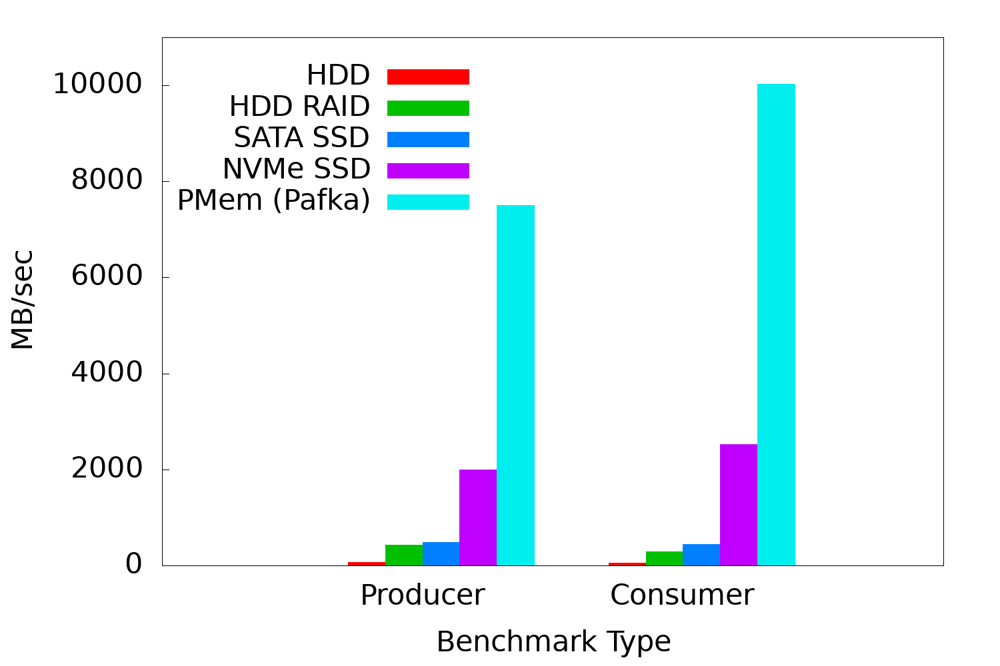
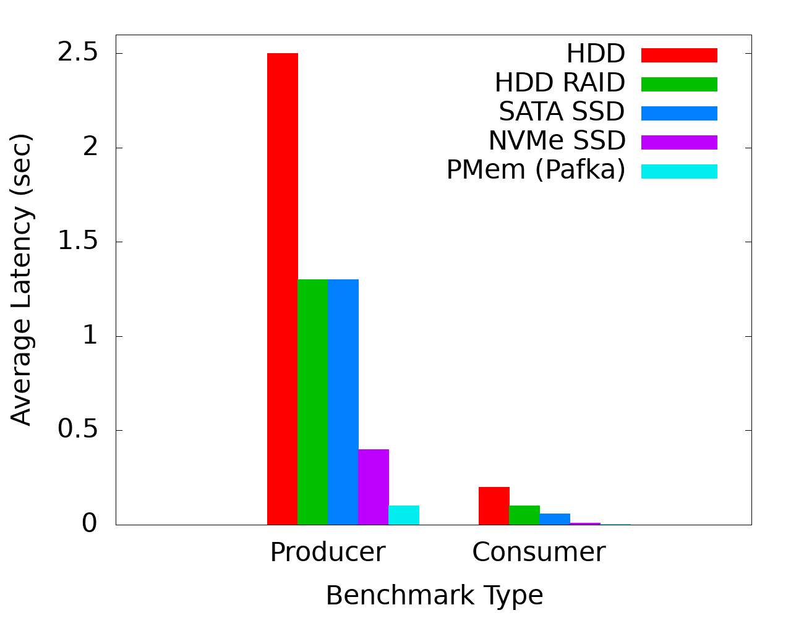

[](https://join.slack.com/t/memarkworkspace/shared_invite/zt-o1wa5wqt-euKxFgyrUUrQCqJ4rE0oPw)
[](https://github.com/4paradigm/pafka/releases)
[](https://hub.docker.com/repository/docker/pafka/pafka-dev)
[](https://github.com/4paradigm/pafka/stargazers)
[](https://github.com/4paradigm/pafka/network/members)
[](https://github.com/4paradigm/pafka/blob/main/LICENSE)


Pafka: PMem-Accelerated Kafka
===

## Introduction

Pafka is an evolved version of Apache Kafka developed by [MemArk](https://memark.io/).
Kafka is an open-source distributed event streaming/message queue system for handling real-time data feeds efficiently and reliably.
However, its performance (e.g., throughput) is constrained by the disk bandwidth, which further deteriorates due to the file system overhead.

Pafka equips Kafka with Intel® Optane™ Persistent Memory (PMem) support, which relies on the native pmdk libraries
rather than treat PMem as a normal disk device. 
With careful design and implementation, Pafka can achieve 7.5 GB/s write throughput and 10 GB/s read throughput in terms of single-server performance.

**Note that this is currently a beta-release. While we are doing further optimization and testing, 
stable versions will be released soon.**

## Pafka vs Kafka

### Performance

We conducted some preliminary experiments on our in-house servers.
One server is used as the Kafka broker server,
and another two servers as the clients.
Each of the client servers run 16 clients to saturate the server throughput.
We're using the `ProducerPerformance` and `ConsumerPerformance` shipped by Kafka
and the record size of 1024 for the benchmark.

#### Server Specification

The server spec is as follows:

|Item|Spec|
|---|----|
|CPU|Intel(R) Xeon(R) Gold 6252 Processor (24 cores/48 threads) * 2|
|Memory|376 GB|
|Network|Mellanox ConnectX-5 100 GBps|
|PMem|128 GB x 6 = 768 GB|

The storage spec and performance:

|Storage Type|Write (MB/s)|Read (MB/s)|
|---|---|---|
|HDD|32k: 5.7 <br/> 320k: 37.5 <br/> 3200k: 78.3 <br/>|86.5|
|HDD RAID|530|313|
|Sata SSD|458|300|
|NVMe SSD|2,421|2,547|
|PMem|9,500|37,120|

For `HDD`, we use batch size of 32k, 320k and 3200k for write, respectively, while read does not change much as we increase the batch size.
For other storage types, we use batch size of 32k, as increasing to larger batch size does not increase the performance much.
For `PMem`, we use `PersistentMemoryBlock` of [pmdk llpl](https://github.com/4paradigm/llpl) for the performance benchmark.

#### Performance Results

<p float="left">
    
    
</p>

<!---
Storage Type |	producer throughput | consumer throughput|
|---|---|---|
|HDD|74394.0 records/sec (72.64 MB/sec)|63143.9413 records/sec (61.6640 MB/s)|
HDD	RAID | 444336.5 records/sec (433.92 MB/sec) | 293637.6567 records/sec (286.7553 MB/s)|
Sata SSD |492760.7 records/sec (481.22 MB/sec) | 456223.8026 records/sec (445.5311 MB/s) |
NVMe SSD | 2050658.2 records/sec (2002.61 MB/sec) | 2582104.8498 records/sec (2521.5865 MB/s) |
PMem (Pafka) | 7688881.9 records/sec (7508.68 MB/sec) |10264739.3093 records/sec (10024.1593 MB/s)|
-->

As we can see, the consumer throughput of Pafka with PMem has almost reached the network bottleneck (100 Gbps ~= 12.5 GB/s).
Compared with NVMe SSD, Pafka boosts the producer throughput by 275% to 7508.68 MB/sec. In terms of latency, Pafka can achieve 
an average latency of 0.1 seconds for both producer and consumer.

### TCO (Total Cost of Ownership)

One of the most significant advantages of persistent memory is to save TCO. Compared with the original HDD/SDD based Kafka, the PMEM-enhanced Pafka reduces the cost by providing higher throughput on a single server. In this section, we only compare the hardware cost as the TCO.

Suppose our target is to provide the overall throughput of 20 GB/sec (the bottleneck can be either producer or consumer depending on the storage type). We compare the PMem based Pafka with SATA SSD based Kafka. Kafka based on SATA SSD should be a common configuration in modern data centers. Please refer to the above Server Specification under the section of Performance Results.

Here is the key information we used for our hardware cost estimation.  

- SATA SSD based Kafka: the hardware cost for a single server is estimated as USD 10,000. 
- PMem based Pafka: We equip the same server configuration with additional 128 GB x 6 = 768 GB PMem. The hardware cost of such a PMem backed server is estimated as USD 13,500.

The below figure demonstrated that, in order to achieve the overall throughput of 20 GB/sec, the numbers of SATA SSD based servers and PMem based servers are 45 and 3, respectively. Furthermore, for the hardware cost, the traditional Kafka (SATA SSD) takes USD 450K, while our Pafka (PMem) solution takes USD 40.5K only. The Pafka solution significantly reduces the hardware cost  to 9% of the traditional Kafka solution only.


## Get Started

For complete documentation of Kafka, refer to [here](README.kafka.md).

### Docker Image
The easiest way to try Pafka is to use the docker image: https://hub.docker.com/repository/docker/pafka/pafka-dev

```
docker run -it -v $YOUR_PMEM_PATH:/mnt/mem pafka:pafka-dev bash
```

where $YOUR_PMEM_PATH is the mount point of PMem (DAX file system) in the host system.

If you use the docker image, you can skip the following `Compile` step.

### Compile

#### Dependencies

- [pmdk pcj](https://github.com/4paradigm/pcj)
- [pmdk llpl](https://github.com/4paradigm/llpl)

> :warning: **We have done some modifications on the original pmdk source codes. 
> So please download the source code from the two repositories provided above.**


**Actually we have already shipped pcj and llpl jars in `libs` folder in the Pafka repository.
They are compiled with java 8 and g++ 4.8.5. In general, you are not required to compile the two libraries
by yourself. However, if you encounter any compilation/running error caused by these two libraries,
you can download the source codes and compile on your own environment.**

##### Compile pmdk libraries

After clone the source code:

    # compile pcj
    cd pcj
    make && make jar
    cp target/pcj.jar $PAFKA_HOME/libs
    
    # compile llpl
    cd llpl
    make && make jar
    cp target/llpl.jar $PAFKA_HOME/libs

 
#### Build Pafka jar

    ./gradlew jar

### Run

#### Environmental setup
To see whether it works or not, you can use any file system with normal hard disk.
For the best performance, it requires the availability of PMem hardware mounted as a DAX file system. 


#### Config

In order to support PMem storage, we add some more config fields to the Kafka [server config](config/server.properties). 

|Config|Default Value|Note|
|------|-------------|----|
|storage.pmem.path|/tmp/pmem|pmem mount path|
|storage.pmem.size|21,474,836,480|pmem size|
|log.pmem.pool.ratio|0.8|A pool of log segments will be pre-allocated. This is the proportion of total pmem size. Pre-allocation will increase the first startup time, but can eliminate the dynamic allocation cost when serving requests.|
|log.channel.type|file|log file channel type. Options: "file", "pmem".<br />"file": use normal FileChannel as vanilla Kafka does <br />"pmem": use PMemChannel, which will use pmem as the log storage|

> :warning: **`log.preallocate` has to be set to `true` if use pmem, as PMem MemoryBlock does not support `append`-like operations.**

Sample config in config/server.properties is as follows:

    storage.pmem.path=/mnt/pmem/kafka/
    storage.pmem.size=107374182400  # 100 GB
    log.pmem.pool.ratio=0.9
    log.channel.type=pmem
    
    log.preallocate=true  # have to set to true if use pmem

#### Start Kafka
Follow instructions in https://kafka.apache.org/quickstart. Basically:

    bin/zookeeper-server-start.sh config/zookeeper.properties
    bin/kafka-server-start.sh config/server.properties


## Limitations

- We only benchmark the performance on the single-server setting. Multiple-server benchmark is undergoing.
- pmdk llpl `MemoryBlock` does not provide a `ByteBuffer` API. 
We did some hacking to provide a zero-copy ByteBuffer API. You may see some warnings from JRE with version >= 9.
We've tested on Java 8, Java 11 and Java 15.


   > WARNING: An illegal reflective access operation has occurred                                                                                                                                                    
   > WARNING: Illegal reflective access by com.intel.pmem.llpl.MemoryAccessor (file:/4pd/home/zhanghao/workspace/kafka/core/build/dependant-libs-2.13.4/llpl.jar) to field java.nio.Buffer.address                   
   > WARNING: Please consider reporting this to the maintainers of com.intel.pmem.llpl.MemoryAccessor                                                                                                                
   > WARNING: Use --illegal-access=warn to enable warnings of further illegal reflective access operations                                                                                                           
   > WARNING: All illegal access operations will be denied in a future release


- Currently, only the log files are stored in PMem, while the indexes are still kept as normal files,
as we do not see much performance gain if we move the indexes to PMem.


## Roadmap

| Version |	Status | Features |
|---|---|---|
|v0.1.0|Released|- Use PMem for data storage <br /> - Significant performance boost compared with Kafka |
|v0.2.0|To be released in June/July 2021|- Layered storage with PMem and other storage medium|


## Community

Pafka is developed by MemArk (https://memark.io/), which is a technical community focusing on empowering modern memory architecture evolution and its application optimization. MemArk is led by 4Paradigm (https://www.4paradigm.com/) and other sponsors (such as Intel).

- Chatting: For any feedback, suggestions, issues, and anythings about using Pafka, you can join our interactive discussion channel at Slack [#pafka-help](https://join.slack.com/t/memarkworkspace/shared_invite/zt-o1wa5wqt-euKxFgyrUUrQCqJ4rE0oPw)
- Development dicussion: If you would like to report a bug, please use the GitHub Issues; if you would like to propose a new feature, or would like to start a pull request, please use the GitHub Discussions, and our developers will respond promptly.
- Forum (Chinese): https://discuss.memark.io/

You can also contact the authors directly for any feedback:
- ZHANG Hao: zhanghao@4paradigm.com
- LU Mian: lumian@4paradigm.com
- YANG Jun: yangjun@4paradigm.com
- CHEN Cheng: chencheng@4apradigm.com


